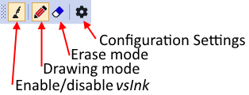

# vsInk

## Introduction

_vsInk_ is a Visual Studio extension that allows adding freeform digital ink to a text document.

## Current Functionality

The current version of _vsInk_ provides the following functionality:
* Draw digital ink in the code editor (any language that uses the standard code editor)
* Erase digital ink
* Save and load digital ink
* Attach (anchor) ink to a location in the text document
* Change the appearance (refit) the ink in response to changes in the underlying document

## Installation Instructions

The current release can be downloaded from https://github.com/csut017/vsInk.2019/releases. vsInk.vsix is a Visual Studio installation package, when it has been downloaded, open it and follow the instructions to install _vsInk_ to a local version of Visual Studio.

The toolbar for _vsInk_ needs to be made visible after it has been installed. To do this, start Visual Studio, then right-click in the toolbar space and select vsInk from the dropdown menu. The toolbar can then be moved into the desired location.

**Note:** _vsInk_ has only been tested in Visual Studio 2019.

## The Toolbar

Most of the functionality in _vsInk_ is controlled via the toolbar:

To add ink to a document, Enable _vsInk_ and ensure drawing mode has been selected. The mouse pointer will then change to a dot, drawing with a mouse (hold down the left button), pen or finger will add ink to the document

Ink can be erased by selecting erase mode and then 'drawing' over the ink to be erased.

Saving and loading will happen automatically when the document is saved or loaded in Visual Studio (e.g. by pressing Ctrl-S).

**Note:** ink is only visible when _vsInk_ is enabled. Enabling _vsInk_ adds a small gray textbox to the bottom-right of the enditor containing the word _vsInk_.

## How It Works

_vsInk_ has a two-step process for adding and drawing (rendering) digital ink annotations. In the first step, the ink is captured and associated with a line in the document (anchoring). This step also converts the ink into a format the _vsInk_ can use. The second step is responsible for rendering the annotation, including any refitting needed to handle changes to the underlying document. The first step is only executed once (when the ink is added), the second step is executed every time the display needs to refresh.

A renderer is responsible for refitting the annotation in response to any changes in the underlying text document. Rather than modifying the original annotation, it draws (renders) a new annotation based on the original. The included renderers are:
* Single stroke
  * Single Point: Draws the original annotation, unmodified. Anchored to the top line of the original annotation.
  * Double Point Stretch: Stretches the annotation so it fits between the original top and bottom lines.
* Segmented
  * Simple Line Split: Splits the annotation per line.
  * Line Split with Joiner: Splits the annotation per line and adds a vertical joining line between the endpoints.
The current renderer can be changed by using the configuration settings.

## History

The original version of _vsInk_ is based on research work by Craig J. Sutherland at the University of Auckland. The current version is a stripped down version with the core functionality.

The following references provide more details on the research versions of _vsInk_:
* Sutherland, C. J. (2017). _An Investigation into Freeform, Dynamic, Digital Ink Annotation for Program Code_ (Doctoral dissertation, ResearchSpace@ Auckland).
* Sutherland, C. J., Luxton-Reilly, A., & Plimmer, B. (2016, September). _Who changed my annotation? An investigation into refitting freeform ink annotations._ In 2016 IEEE Symposium on Visual Languages and Human-Centric Computing (VL/HCC) (pp. 12-20). IEEE.
* Sutherland, C. J., & Plimmer, B. (2013, January). _vsInk: Integrating digital ink with program code in Visual Studio._ In Proceedings of the Fourteenth Australasian User Interface Conference-Volume 139 (pp. 13-22). Australian Computer Society, Inc.

**Note:** the version of _vsInk_ in GitHub does not contain all the functionality mentioned in the references. The missing functionality may be added in future work.